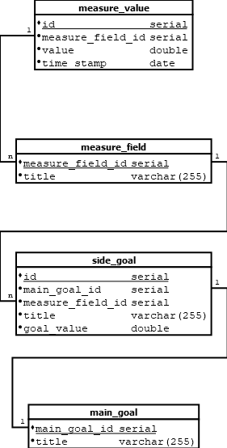
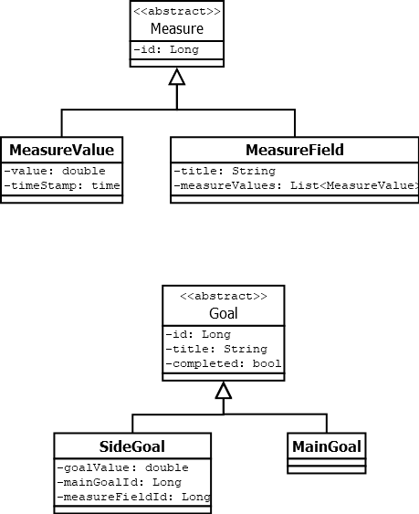

# Build plan

## Database


## Entities


## Services


#Install instructions

## Postgres
To run the project, you will need to have PostgreSQL version 12.4 installed.

The `docker-compose.yml` can be used to create a PostgreSQL service.
Use `docker-compose up -d` in the project root to start it (after having started Docker).

### Database
Under `/db` run the following scripts in order:
1. `user_schema.sql`
2. `create_tables.sql`

If you want to test, data continue with:
3. `insert_dummy_data.sql`

##PostgreSQL JDBC Driver as Jboss Module

1. Download the appropriate PostgreSQL JDBC driver (e.g. 42.2.20)
2. `mkdir -p $WILDFLY_HOME/modules/org/postgresql/main`
3.  `echo "<?xml version=\"1.0\" encoding=\"UTF-8\"?>
<module xmlns=\"urn:jboss:module:1.1\" name=\"org.postgresql\">
<resources>
<resource-root path=\"postgresql-42.2.20.jar\"/>
</resources>
<dependencies>
<module name=\"javax.api\"/>
<module name=\"javax.transaction.api\"/>
</dependencies>
</module>" >> $WILDFLY_HOME/modules/org/postgresql/main/module.xml`
4. `cp ~/Downloads/postgresql-42.2.20.jar $WILDFLY_HOME/modules/org/postgresql/main/`

##WildFly Configuration
You will need to have the following in the WildFly datasources subsystem (
in `$WILDFLY_HOME/standalone/configuration/standalone.xml`)

This implies that the PostgreSQL driver is installed as a JBoss module

```
<datasource jndi-name="java:/HabitDS" pool-name="HabitDS">
    <connection-url>jdbc:postgresql://localhost:5432/habitgoals</connection-url>
    <driver-class>org.postgresql.Driver</driver-class>
    <driver>postgresql</driver>
    <security>
        <user-name>habit</user-name>
        <password>password</password>
    </security>
    <validation>
        <valid-connection-checker class-name="org.jboss.jca.adapters.jdbc.extensions.postgres.PostgreSQLValidConnectionChecker"/>
        <background-validation>true</background-validation>
        <exception-sorter class-name="org.jboss.jca.adapters.jdbc.extensions.postgres.PostgreSQLExceptionSorter"/>
    </validation>
</datasource>
<drivers>
    <driver name="h2" module="com.h2database.h2">
        <xa-datasource-class>org.h2.jdbcx.JdbcDataSource</xa-datasource-class>
    </driver>
    <driver name="postgresql" module="org.postgresql">
        <driver-class>org.postgresql.Driver</driver-class>
    </driver>
</drivers>
```